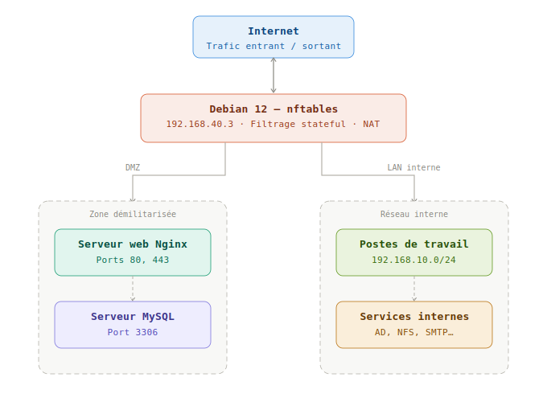

# RP-05 — Audit et Sécurité Réseau

**Réalisation Professionnelle — BTS SIO SISR**
**ANDREO Vincent — IRIS Nice — 2026**

---

## Contexte et objectifs

Dans le cadre du BTS SIO option SISR, cette réalisation professionnelle porte sur l'**audit complet de la sécurité d'une infrastructure réseau virtualisée** hébergée sur un hyperviseur KVM/QEMU sous Debian 12.

L'objectif était d'identifier les vulnérabilités, de déployer une architecture sécurisée (DMZ + pare-feu nftables), de durcir les hôtes, puis de valider l'ensemble par des tests d'intrusion.

---

## Architecture déployée


---

## Déroulement en 4 phases

### Phase 1 — Audit initial (Semaine 1)

- Découverte réseau complète avec **Nmap** (scan SYN, UDP, scripts NSE)
- Scan de vulnérabilités avec **OpenVAS** sur tous les hôtes
- **38 CVE identifiées** dont 8 critiques (CVSS ≥ 9.0)
- Rapport d'audit complet avec priorisation des risques (CVSS)

### Phase 2 — Déploiement nftables + DMZ (Semaine 2)

- Installation et configuration de **nftables** sur Debian 12 (pare-feu Linux kernel netfilter)
- Création de la **DMZ** (zone démilitarisée) avec interfaces eth0/eth1/eth2
- Politique par défaut : **deny-all** (drop toutes les connexions non autorisées)
- Règles NAT, port forwarding contrôlé, logging des paquets bloqués
- Fichier de configuration : `/etc/nftables.conf`

### Phase 3 — Durcissement CIS Benchmark (Semaine 3)

- Application des recommandations **CIS Benchmark Debian Linux**
- Configuration SSH : port non standard, désactivation root, authentification par clé uniquement
- Déploiement **Suricata** (IDS/IPS multi-thread) avec règles ET/Open
- Déploiement **CrowdSec** avec collections : `crowdsecurity/linux`, `crowdsecurity/sshd`, `crowdsecurity/nginx`
- Déploiement **WireGuard** (wg-easy) — VPN managé via interface web (port 51820/UDP, UI 51821/TCP)
- Score **Lynis : 69/100** (vs 42/100 avant durcissement)
- Gestion des exceptions documentées : `ip_forward` (requis par KVM), faux positifs CVE

### Phase 4 — Tests d'intrusion (Semaine 4)

- **12 tests d'intrusion** exécutés sur l'infrastructure durcie
- Tests : scan évasif Nmap, brute-force SSH (Hydra), exploitation web (SQLMap, Nikto), traversée DMZ
- **Résultat : 12/12 PASS** — aucune intrusion aboutie
- Rapport de pentest avec preuves d'écran et recommandations finales

---

## Résultats obtenus

| Indicateur | Avant | Après |
|------------|-------|-------|
| Score Lynis | 42/100 | **69/100** |
| CVE critiques ouvertes | 8 | **0** |
| Ports exposés inutilement | 17 | **1** (container école) |
| Tests d'intrusion réussis | N/A | **0/12**
| WireGuard VPN | Non déployé | **✅ Actif** (healthy) |
| Services avec auth par clé | 0% | **100%** |
| IPs bannies CrowdSec (CAPI) | 0 | **16 077** |

---

## Fichiers du dépôt

| Fichier | Description |
|---------|-------------|
| `RP-05-ANDREO-Vincent.docx` | Rapport technique complet (4 phases, scripts, captures) |
| `Fiche-RP05-ANDREO-Vincent.docx` | Fiche officielle ANNEXE 7-1-A (formulaire BTS) |
| `Présentation-5min-RP05-ANDREO-Vincent.docx` | Texte de présentation orale 5 minutes |

---

## Commandes clés

```bash
# Vérifier les règles nftables actives
nft list ruleset

# Lancer un audit Lynis complet
lynis audit system --quick

# Scanner l'infrastructure avec Nmap
nmap -sS -sV -O -A --script vuln 192.168.40.0/24

# Vérifier le statut CrowdSec
cscli metrics
cscli decisions list

# Voir les alertes Suricata en temps réel
tail -f /var/log/suricata/fast.log
```

---

## Compétences validées

- **A1.1** — Analyse du besoin et définition du périmètre de sécurité
- **A1.2** — Mise en place d'une architecture sécurisée (pare-feu, DMZ)
- **A3.1** — Administration et sécurisation des équipements réseau
- **A3.3** — Mise en œuvre de solutions de détection d'intrusion
- **A5.1** — Participation aux tests de sécurité (pentest)

---

## Environnement technique

- **OS Hyperviseur** : Debian 12 (Bookworm) — KVM/QEMU
- **OS VMs** : Debian 12 sur toutes les machines
- **Réseau** : 192.168.40.0/24 (LAN), DMZ isolée
- **Virtualisation** : `virsh`, `virt-manager`
- **École** : IRIS Nice — Promotion BTS SIO SISR 2025-2026

---

*Réalisation professionnelle validée dans le cadre de l'examen E5/E6 BTS SIO.*


