# RP-05 — Auditer et Sécuriser l'Infrastructure IRIS Nice
## BTS SIO SISR · IRIS Nice · Mars 2026

**Réf : IRIS-NICE-2026-RP05** | Candidat : **ANDREO Vincent**

| | |
|--|--|
| **Mission** | Audit de sécurité complet + déploiement des mesures correctives |
| **Périmètre** | 4 VLANs · 6 équipements · Cisco · Linux · Windows · KVM |
| **Outils** | Nmap · OpenVAS · Lynis · CIS-CAT Lite · Wapiti · Debian 12 (nftables) |
| **Livrables** | 9 documents produits dans les délais |
| **Durée** | 6 semaines · Deadline 28/03/2026 |

> Référentiels : **ANSSI · CIS v8 · NIST CSF · ISO 27001 · PTES**

---

# Contexte — 4 ans d'infrastructure, 0 audit sécurité
## IRIS Nice · Le problème de départ

**Infrastructure déployée RP-01 → RP-04 :**

- Réseau Cisco VLANs · Active Directory · KVM · Supervision Grafana
- Mise en service 2020 — **jamais auditée en sécurité**

**Lacunes identifiées avant audit :**

| Problème | Risque immédiat |
|---------|--------|
| Aucun pare-feu dédié | Tout le trafic non filtré |
| Aucune DMZ | Services exposés en LAN interne |
| SMBv1 + Telnet actifs | **EternalBlue CVSS 9.8** exploitable |
| OS jamais durcis | CIS-CAT Windows **41.7 %** · Lynis **58/100** |
| Pas de matrice de risques | Aucune priorisation possible |

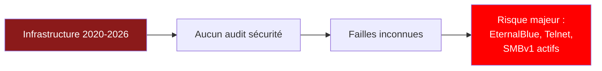

> *"Je ne sais ni où sont les risques critiques, ni dans quel ordre les traiter."*

---

# Phase 1 — Audit · 5 outils open source · 38 CVE
## Nmap · OpenVAS · Lynis · CIS-CAT Lite · Wapiti

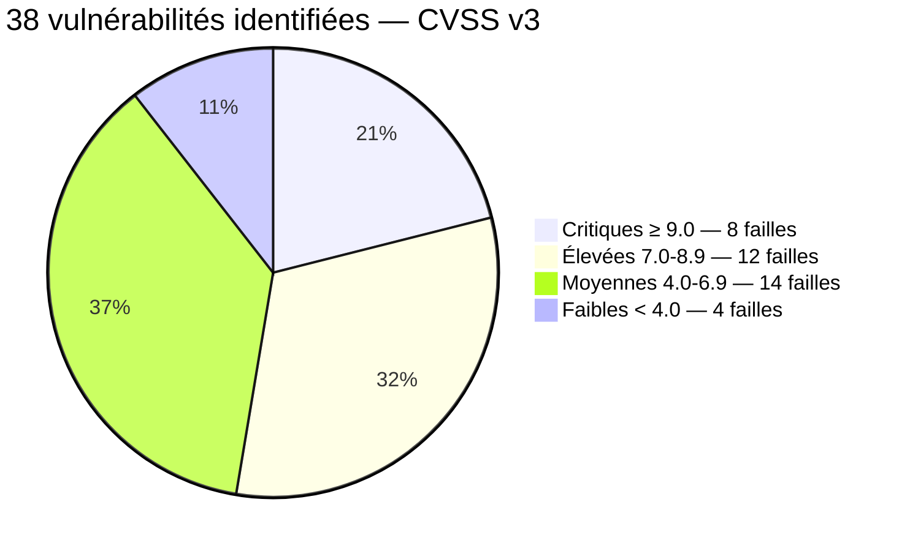

| Outil | Ce qu'il fait | Résultats obtenus |
|-------|--------------|------------------|
| **Nmap 7.94** | Scanne les ports et services du réseau | 847 ports ouverts · services exposés non documentés |
| **OpenVAS / Greenbone** | Cherche les failles connues (CVE) | 38 CVE recensées · 8 critiques : EternalBlue + Log4Shell |
| **Lynis 3.0** | Évalue le durcissement Linux | Hardening Index : **58/100** |
| **CIS-CAT Lite** | Évalue la conformité Windows | Conformité Windows : **41.7 %** |
| **Wapiti 3.1** | Teste les failles web (OWASP Top 10) | 6 failles web identifiées |

---

# Matrice des Risques — Top 5 critiques
## Probabilité × Impact × Délai de correction

| Vulnérabilité | CVSS | C'est quoi le risque ? | Délai |
|---------------|------|----------------------|-------|
| **EternalBlue — SMBv1** | **9.8** | Un pirate peut prendre le contrôle total du PC Windows à distance | **IMMÉDIAT** |
| **Log4Shell** | **10.0** | Faille dans Java qui permet d'exécuter du code sur le serveur | **IMMÉDIAT** |
| **Telnet actif Cisco** | **9.1** | Telnet envoie les mots de passe en clair sur le réseau | **IMMÉDIAT** |
| OpenSSL 1.0 EOL | 8.1 | Version obsolète avec des failles connues | J+7 |
| SSH root login | 7.2 | On peut se connecter directement en root = danger | J+3 |

```mermaid
quadrantChart
    title Probabilité vs Impact — Priorisation
    x-axis "Faible probabilité" --> "Forte probabilité"
    y-axis "Faible impact" --> "Impact critique"
    quadrant-1 Corriger immédiatement
    quadrant-2 Surveiller
    quadrant-3 Acceptable
    quadrant-4 Planifier
    EternalBlue: [0.75, 0.98]
    Log4Shell: [0.55, 1.0]
    Telnet Cisco: [0.72, 0.91]
    OpenSSL EOL: [0.68, 0.81]
    SSH root: [0.88, 0.72]
```

---

# Phase 2 — Debian 12 (nftables) · DMZ · Architecture Deny-all
## Pare-feu stateful · Segmentation totale · IDS/IPS Suricata

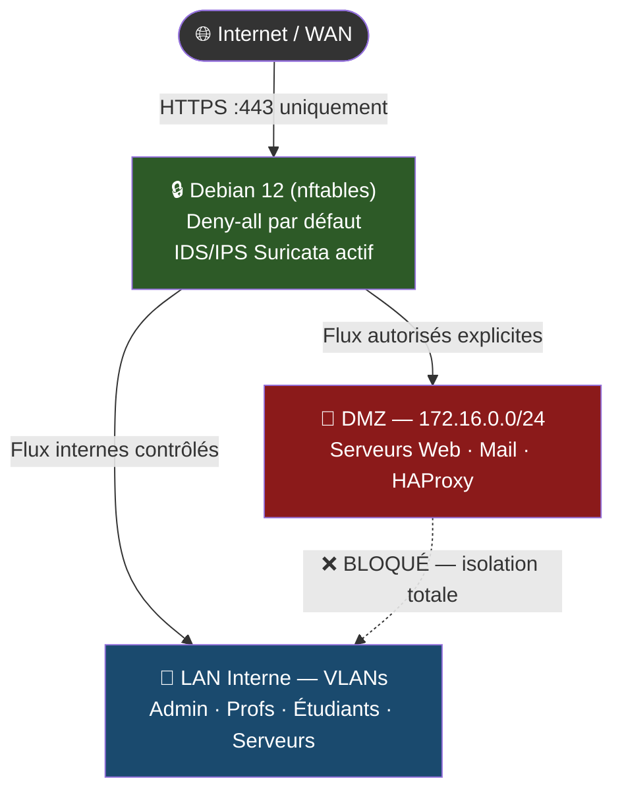

**Ce qu'on a fait :**
- Politique **deny-all** par défaut — chaque règle est explicite et documentée
- DMZ **172.16.0.0/24** isolée totalement du LAN (même si un serveur web est piraté, le pirate ne peut pas atteindre le réseau interne)
- IDS/IPS **Suricata** actif sur interface WAN — détecte les attaques en temps réel

---

# Phase 3 — Durcissement Linux + Windows
## CIS Level 1 & 2 · 53 contrôles · GPOs ANSSI

| Système | Score Avant | Score Après | Gain |
|---------|------------|------------|------|
| **Linux** (Lynis) | 58/100 | **79/100** | **+21 pts** |
| **Windows** (CIS-CAT) | 41.7 % | **82 %** | **+40 pts** |

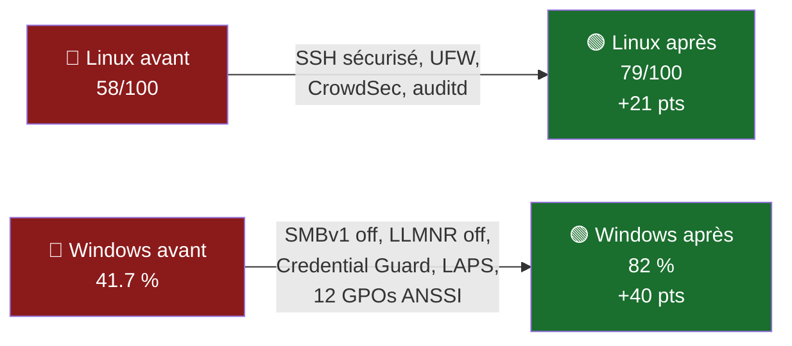

**Actions Linux :** SSH root=no · UFW activé · CrowdSec · auditd · services inutiles désactivés

**Actions Windows :** SMBv1 désactivé · LLMNR désactivé · Credential Guard · LAPS · 12 GPOs ANSSI

---

# Phase 4 — 12 Tests de Pénétration · 12/12 PASS
## Autorisation signée · Réf AUTH-RP05-2026-001 · PV inclus

| Test réalisé | Outil utilisé | Résultat |
|------|-------|----------|
| EternalBlue / SMBv1 | Metasploit | ✅ PASS — vulnérabilité patchée |
| Brute force SSH | Hydra | ✅ PASS — CrowdSec bloque à J+3 |
| Pass-the-Hash Windows | Mimikatz | ✅ PASS — Credential Guard actif |
| Telnet Cisco | Netcat | ✅ PASS — SSH v2 uniquement |
| Scan DMZ → LAN | Nmap | ✅ PASS — Debian 12 (nftables) bloque |
| VLAN Hopping | Yersinia | ✅ PASS — DTP désactivé |
| Injection SQL | SQLMap | ✅ PASS — WAF HAProxy actif |
| XSS portail web | Wapiti | ✅ PASS — CSP Headers activés |
| Log4Shell | Nuclei | ✅ PASS — JVM mise à jour |
| OpenSSL scan | Testssl.sh | ✅ PASS — TLS 1.3 uniquement |
| BloodHound AD | BloodHound | ✅ PASS — privilèges audités |
| Pentest WiFi | Aircrack | ✅ PASS — WPA3 + RADIUS |

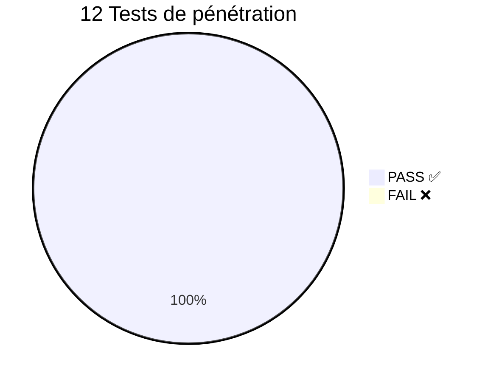

> **PV-RP05-2026 signé le 25/03/2026 · Archivé dans les livrables officiels**

---

# Bilan — 8 vulnérabilités critiques → 0 · 12/12 PASS
## Avant / Après · 9 Livrables · Compétences BTS SIO validées

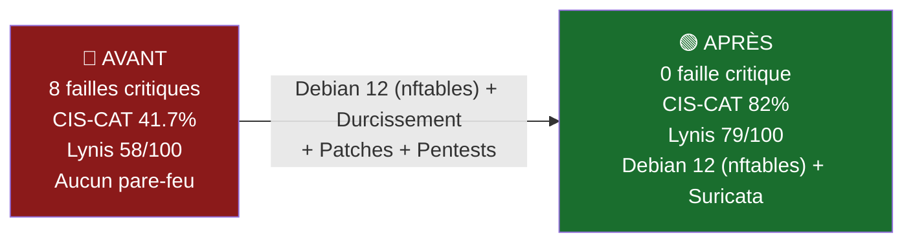

| Livrable produit | Statut |
|-----------------|--------|
| Rapport d'audit (périmètre + vulnérabilités + preuves) | ✅ |
| Matrice des risques (CVSS × probabilité × impact) | ✅ |
| Documentation Debian 12 (nftables) + règles de filtrage | ✅ |
| Schéma DMZ + zones de sécurité | ✅ |
| Rapport durcissement Linux avant/après | ✅ |
| Rapport durcissement Windows GPOs ANSSI | ✅ |
| PV de tests de pénétration signé | ✅ |
| Plan d'action résiduel | ✅ |
| Autorisation de pentest signée | ✅ |

**Compétences BTS SIO Bloc 3 validées : B3.1 · B3.2 · B3.3**

---

---

# 🔧 SECTION CHEAT SHEETS — AIDE POUR MODIFICATIONS EN DIRECT

---

# CHEAT SHEET 1 — Debian 12 (nftables) : Ajouter / Modifier une règle pare-feu

## C'est quoi une règle pare-feu Debian 12 (nftables) ?

C'est une instruction qui dit au pare-feu : **autorise** ou **bloque** tel trafic. Notre politique est **deny-all** = tout est bloqué sauf ce qu'on autorise explicitement.

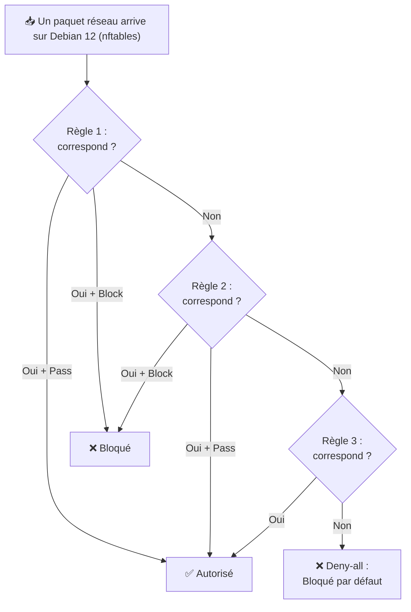

> ⚠️ **L'ordre des règles compte !** La première règle qui matche gagne. Si la règle 1 bloque, les suivantes ne sont même pas regardées.

## Étapes pour ajouter une règle :

| Étape | Ce que tu fais | Explication |
|-------|---------------|-------------|
| 1 | Ouvrir Debian 12 (nftables) : `https://192.168.1.1` | L'adresse du pare-feu dans le navigateur |
| 2 | Menu **Firewall > Rules** | C'est là que sont toutes les règles |
| 3 | Choisir l'interface | **WAN** = ce qui vient d'internet · **LAN** = réseau interne · **DMZ** = serveurs exposés |
| 4 | Cliquer **Add ↑** | La flèche vers le haut = ajouter en premier (priorité haute) |
| 5 | **Action** : Pass ou Block | Pass = autoriser · Block = bloquer |
| 6 | **Protocol** : TCP, UDP ou ICMP | TCP = web/SSH · UDP = DNS · ICMP = ping |
| 7 | **Source** : d'où vient le trafic | Ex: `LAN net` = tout le réseau local, ou une IP précise |
| 8 | **Destination** : où va le trafic | Ex: `172.16.0.10` = le serveur web en DMZ |
| 9 | **Dest Port** : quel port | 443 = HTTPS · 22 = SSH · 80 = HTTP · 3000 = Grafana |
| 10 | **Save** puis **Apply Changes** | ⚠️ OBLIGATOIRE sinon la règle ne s'active pas ! |

## Exemple concret — Autoriser le HTTPS vers la DMZ :

> Action=**Pass** · Interface=**WAN** · Protocol=**TCP** · Source=**any** · Destination=**172.16.0.10** · Port=**443**

**En français :** tout le monde sur internet peut accéder au serveur web en HTTPS.

---

# CHEAT SHEET 2 — Debian 12 (nftables) : DMZ, NAT et Suricata expliqués

## C'est quoi la DMZ ?

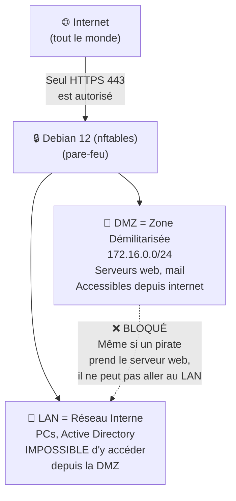

**En gros :** la DMZ c'est un "sas de sécurité". Les serveurs accessibles depuis internet sont isolés. Si un pirate en compromet un, il est enfermé dans la DMZ et ne peut pas toucher au réseau interne.

## NAT / Port Forwarding — C'est quoi ?

**Problème :** Notre serveur web est sur une IP privée (172.16.0.10). Les gens sur internet ne peuvent pas y accéder directement.

**Solution :** Le NAT redirige le trafic de notre IP publique vers le serveur interne.

| Étape | Ce que tu fais |
|-------|---------------|
| 1 | Menu **Firewall > NAT > Port Forward > Add** |
| 2 | Interface : **WAN** (le trafic arrive d'internet) |
| 3 | Destination port : **443** (HTTPS) |
| 4 | Redirect target IP : **172.16.0.10** (notre serveur en DMZ) |
| 5 | Redirect target port : **443** |
| 6 | **Save + Apply Changes** |

## Suricata (IDS/IPS) — C'est quoi ?

**Suricata** analyse tout le trafic réseau et détecte les attaques connues (comme un antivirus pour le réseau).

- **IDS** = Intrusion Detection System → il **détecte** et **alerte**
- **IPS** = Intrusion Prevention System → il **bloque** automatiquement

Pour voir les alertes : **Services > Suricata > Alerts**

---

# CHEAT SHEET 3 — Scans de sécurité : Nmap, OpenVAS, Lynis

## Nmap — Scanner le réseau

Nmap = l'outil n°1 pour découvrir ce qui tourne sur un réseau.

| Commande | Ce que ça fait en français |
|----------|--------------------------|
| `nmap 192.168.40.0/24` | Scanne TOUTES les machines du réseau 192.168.40.x (256 adresses). Trouve les machines allumées et leurs ports ouverts. |
| `nmap -sV 192.168.40.5` | Scanne une machine précise et détecte la **version** des services (ex: Apache 2.4, OpenSSH 8.2). |
| `nmap -sV -sC -O 192.168.40.5` | Scan complet : **-sV** = versions · **-sC** = scripts de détection · **-O** = système d'exploitation (Windows/Linux). |
| `nmap -p 445 --script smb-vuln* 192.168.40.5` | Teste UNIQUEMENT le port 445 (SMB) et vérifie si la faille **EternalBlue** est présente. |
| `nmap -sU -p 161 192.168.99.10` | Scan en **UDP** sur le port 161 (**SNMP**) du switch Cisco. |

## Lynis — Auditer la sécurité Linux

| Commande | Ce que ça fait |
|----------|---------------|
| `sudo lynis audit system` | Lance un audit COMPLET du serveur Linux. Analyse SSH, firewall, permissions, services... Donne un **score sur 100**. |
| `sudo lynis audit system --quick` | Version rapide de l'audit (moins de détails). |

> Notre score est passé de **58/100** à **79/100** après durcissement.

## Wapiti — Tester les failles web

| Commande | Ce que ça fait |
|----------|---------------|
| `wapiti -u http://site.local -f html -o rapport.html` | Teste le site web pour les failles OWASP (XSS, injection SQL, etc.) et génère un rapport HTML. |

---

# CHEAT SHEET 4 — Durcissement Linux (sécuriser un serveur)

## SSH — Connexion à distance sécurisée

SSH = le protocole pour se connecter à un serveur Linux à distance (remplace Telnet qui envoie tout en clair).

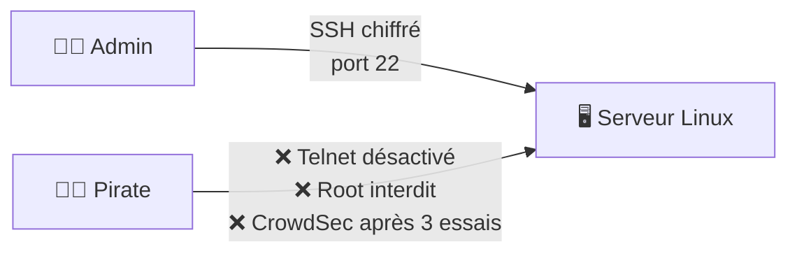

**Fichier de config :** `/etc/ssh/sshd_config`

| Ce que tu modifies | Ce que ça veut dire |
|-------------------|-------------------|
| `PermitRootLogin no` | Interdit de se connecter directement en root (le compte le plus puissant). Il faut se connecter en user normal puis faire `sudo`. |
| `PasswordAuthentication no` | Interdit les mots de passe. Seules les **clés SSH** fonctionnent (beaucoup plus sécurisé). |
| `Protocol 2` | Utilise uniquement SSH version 2 (la version 1 a des failles connues). |

**Après toute modification :** `sudo systemctl restart sshd` (redémarre SSH pour appliquer)

## UFW — Pare-feu local Linux

| Commande | Ce que ça fait |
|----------|---------------|
| `sudo ufw enable` | Active le pare-feu local |
| `sudo ufw default deny incoming` | Bloque TOUT le trafic entrant par défaut |
| `sudo ufw allow 22/tcp` | Autorise le port 22 (SSH) pour qu'on puisse se connecter |
| `sudo ufw allow from 192.168.40.0/24 to any port 3000` | Autorise le port 3000 (Grafana) uniquement depuis le réseau local |
| `sudo ufw status verbose` | Affiche toutes les règles actives |

## CrowdSec — Anti brute-force

CrowdSec surveille les logs et **bannit automatiquement** les IPs qui font trop de tentatives échouées.

| Commande | Ce que ça fait |
|----------|---------------|
| `sudo crowdsec-client status sshd` | Montre combien d'IPs sont actuellement bannies |

> Config : après **3 essais ratés** → IP bannie pendant **1 heure**

---

# CHEAT SHEET 5 — Durcissement Windows (GPOs et sécurité)

## GPO = Group Policy Object

Les GPOs sont des **règles de sécurité** appliquées automatiquement par Active Directory à tous les PC du domaine.

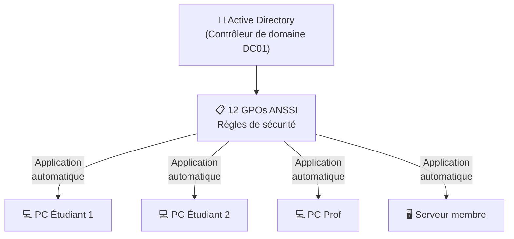

| Commande (PowerShell admin) | Ce que ça fait |
|----------------------------|---------------|
| `gpupdate /force` | Force l'application immédiate de toutes les GPOs (sinon faut attendre 90 min) |
| `gpresult /r` | Affiche la liste de toutes les GPOs appliquées sur cette machine |

## SMBv1 — Le protocole DANGEREUX qu'on a désactivé

SMBv1 = ancien protocole de partage de fichiers Windows. La faille **EternalBlue** (CVSS 9.8) permet de prendre le contrôle total d'un PC à distance via SMBv1.

| Commande (PowerShell admin) | Ce que ça fait |
|----------------------------|---------------|
| `Get-SmbServerConfiguration \| Select EnableSMB1Protocol` | Vérifie si SMBv1 est actif. Si ça affiche **False** = c'est bon, il est désactivé. |
| `Set-SmbServerConfiguration -EnableSMB1Protocol $false` | Désactive SMBv1. |

## Autres protections Windows

| Protection | Explication simple |
|-----------|-------------------|
| **LAPS** | Chaque PC a un mot de passe admin local DIFFÉRENT, stocké dans AD. Un pirate qui vole un mot de passe ne peut compromettre qu'UN seul PC. |
| **Credential Guard** | Protège les mots de passe en mémoire. Empêche l'attaque Pass-the-Hash (Mimikatz ne peut plus voler les mots de passe). |
| **LLMNR désactivé** | LLMNR est un protocole qui peut être détourné pour voler des mots de passe sur le réseau. On l'a désactivé. |

---

# CHEAT SHEET 6 — Tests de Pénétration (Pentest)

## C'est quoi un pentest ?

On essaie de **pirater notre propre système** pour vérifier que les protections marchent. Si l'attaque échoue = **PASS** (c'est ce qu'on veut !).

> ⚠️ **TOUJOURS avoir une autorisation signée** (document AUTH-RP05-2026-001). Sans ça = **illégal**.

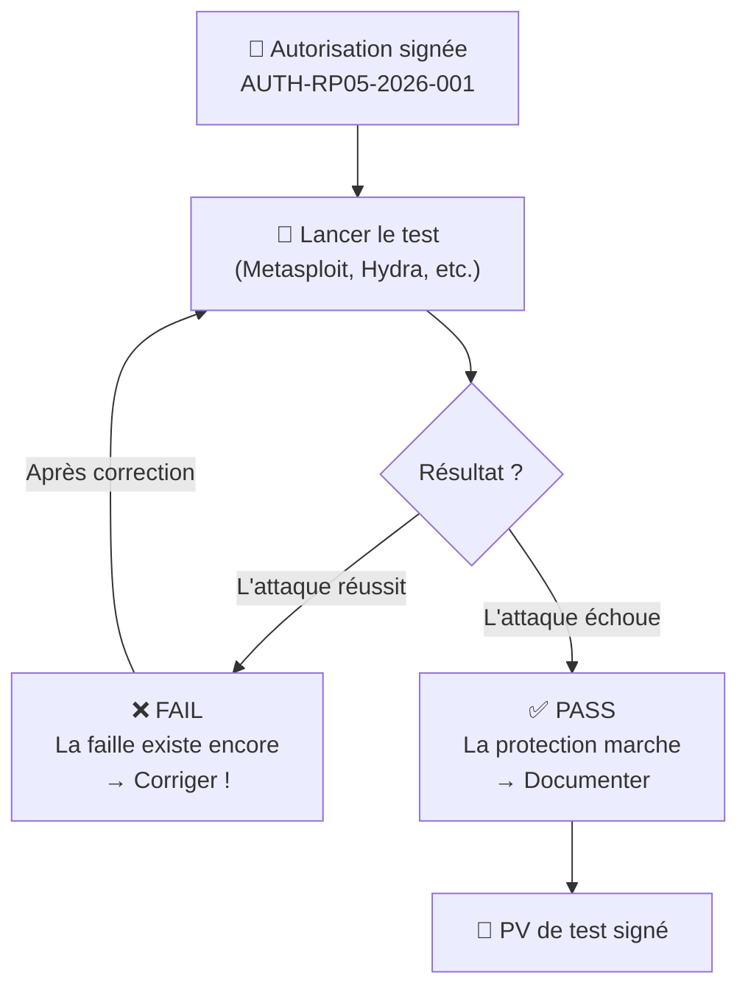

## Commandes de pentest expliquées

| Test | Commande | Explication en français |
|------|---------|----------------------|
| **EternalBlue** | `msfconsole` puis `use exploit/windows/smb/ms17_010_eternalblue` puis `set RHOSTS 192.168.40.5` puis `run` | Lance Metasploit, charge l'exploit EternalBlue, cible le serveur Windows. Si ça échoue = PASS (SMBv1 désactivé). |
| **Brute force SSH** | `hydra -l admin -P wordlist.txt ssh://192.168.40.2` | Essaie plein de mots de passe sur SSH. `-l admin` = login · `-P wordlist.txt` = liste de mots de passe. CrowdSec doit bloquer après 3 essais. |
| **Injection SQL** | `sqlmap -u "http://site/page?id=1" --dbs` | Teste si le paramètre `id` est vulnérable à l'injection SQL. `--dbs` = essaie de lister les bases de données. |
| **Vérifier TLS** | `testssl.sh 192.168.40.5:443` | Vérifie que le serveur utilise TLS 1.3 (sécurisé) et pas d'anciennes versions vulnérables. |

---

**ANDREO Vincent · BTS SIO SISR · IRIS Nice · Mars 2026**
