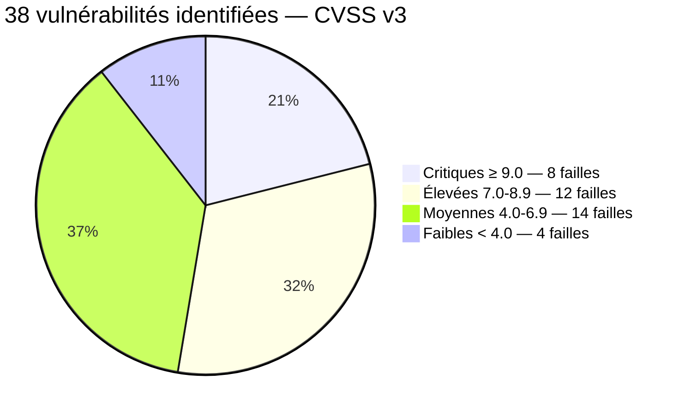
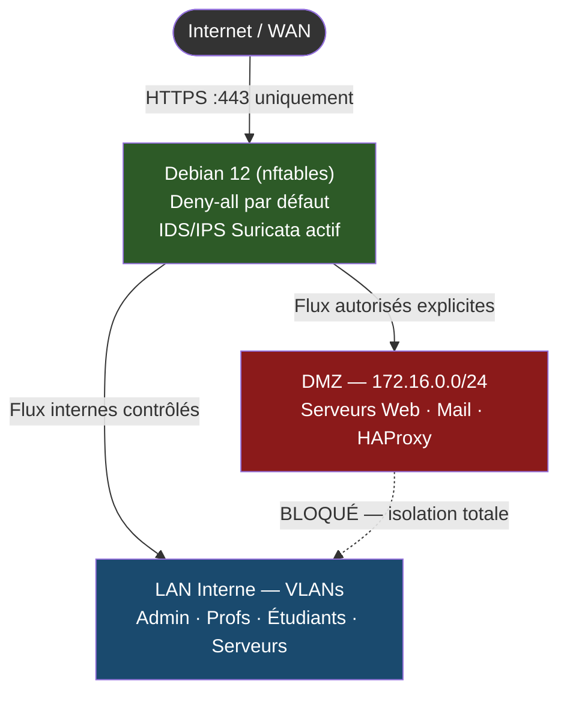
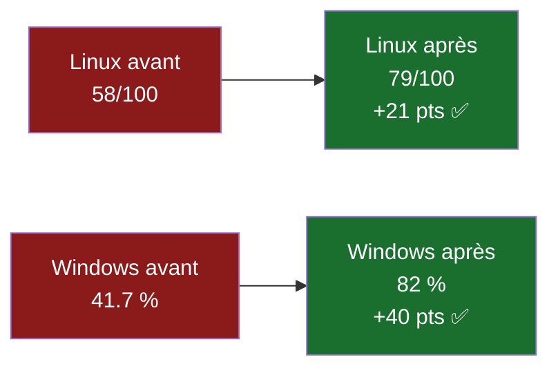
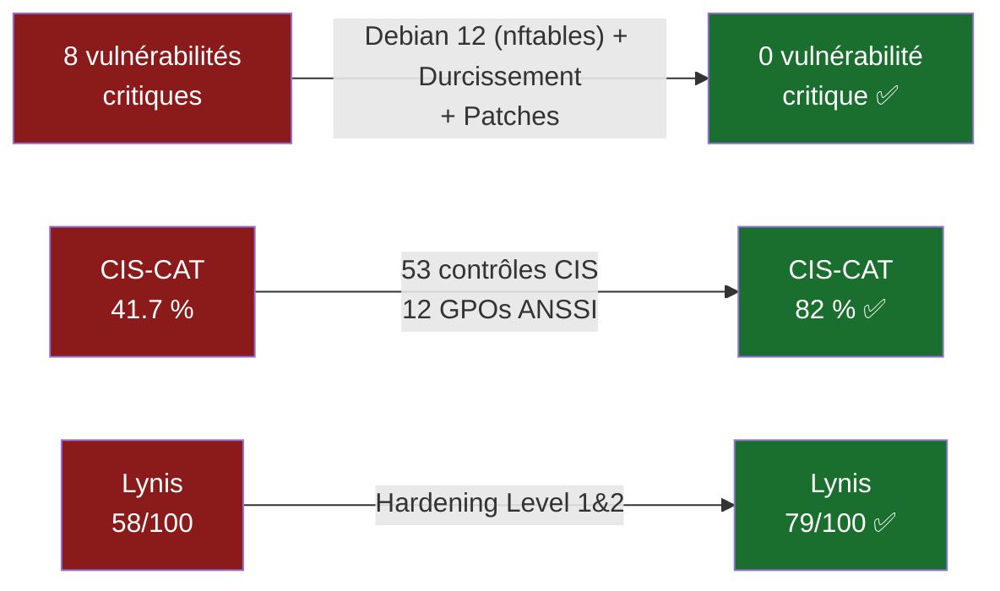

# RP-05 — Auditer et Sécuriser l'Infrastructure IRIS Nice
## BTS SIO SISR · IRIS Nice · Mars 2026

**Réf : IRIS-NICE-2026-RP05** | Candidat : **ANDREO Vincent**

| | |
|--|--|
| **Mission** | Audit de sécurité complet + déploiement des mesures correctives |
| **Périmètre** | 4 VLANs · 6 équipements · Cisco · Linux · Windows · KVM |
| **Outils** | Nmap · OpenVAS · Lynis · CIS-CAT Lite · Wapiti · Debian 12 (nftables) |
| **Livrables** | 9 documents produits dans les délais |
| **Durée** | 6 semaines · Deadline 28/03/2026 |

> Référentiels : **ANSSI · CIS v8 · NIST CSF · ISO 27001 · PTES**

---

# Contexte — 4 ans d'infrastructure, 0 audit sécurité
## IRIS Nice · Le problème de départ

**Infrastructure déployée RP-01 → RP-04 :**

- Réseau Cisco VLANs · Active Directory · KVM · Supervision Grafana
- Mise en service 2020 — **jamais auditée en sécurité**

**Lacunes identifiées avant audit :**

| Problème | Risque immédiat |
|---------|--------|
| Aucun pare-feu dédié | Tout le trafic non filtré |
| Aucune DMZ | Services exposés en LAN interne |
| SMBv1 + Telnet actifs | **EternalBlue CVSS 9.8** exploitable |
| OS jamais durcis | CIS-CAT Windows **41.7 %** · Lynis **58/100** |
| Pas de matrice de risques | Aucune priorisation possible |

> *"Je ne sais ni où sont les risques critiques, ni dans quel ordre les traiter."*

---

# Phase 1 — Audit · 5 outils open source · 38 CVE
## Nmap · OpenVAS · Lynis · CIS-CAT Lite · Wapiti



| Outil | Résultats obtenus |
|-------|------------------|
| **Nmap 7.94** | 847 ports ouverts · services exposés non documentés |
| **OpenVAS / Greenbone** | 38 CVE recensées · 8 critiques : EternalBlue + Log4Shell |
| **Lynis 3.0** | Hardening Index : **58/100** |
| **CIS-CAT Lite** | Conformité Windows : **41.7 %** |
| **Wapiti 3.1** | 6 failles web OWASP Top 10 identifiées |

---

# Matrice des Risques — Top 5 critiques
## Probabilité × Impact × Délai de correction

| Vulnérabilité | CVSS | Probabilité | Délai |
|---------------|------|-------------|-------|
| **EternalBlue — SMBv1** | **9.8** | Probable | **IMMÉDIAT** |
| **Log4Shell** | **10.0** | Possible | **IMMÉDIAT** |
| **Telnet actif Cisco** | **9.1** | Probable | **IMMÉDIAT** |
| OpenSSL 1.0 EOL | 8.1 | Probable | J+7 |
| SSH root login | 7.2 | Très probable | J+3 |

```mermaid
quadrantChart
    title Probabilité vs Impact — Priorisation
    x-axis "Faible probabilité" --> "Forte probabilité"
    y-axis "Faible impact" --> "Impact critique"
    quadrant-1 Corriger immédiatement
    quadrant-2 Surveiller
    quadrant-3 Acceptable
    quadrant-4 Planifier
    EternalBlue: [0.75, 0.98]
    Log4Shell: [0.55, 1.0]
    Telnet Cisco: [0.72, 0.91]
    OpenSSL EOL: [0.68, 0.81]
    SSH root: [0.88, 0.72]
```

---

# Phase 2 — Debian 12 (nftables) · DMZ · Architecture Deny-all
## Pare-feu stateful · Segmentation totale · IDS/IPS Suricata



- Politique **deny-all** par défaut — chaque règle est explicite et documentée
- DMZ **172.16.0.0/24** isolée totalement du LAN
- IDS/IPS **Suricata** actif sur interface WAN — alertes remontées dans Grafana

---

# Phase 3 — Durcissement Linux + Windows
## CIS Level 1 & 2 · 53 contrôles · GPOs ANSSI

| Système | Score Avant | Score Après | Gain |
|---------|------------|------------|------|
| **Linux** (Lynis) | 58/100 | **79/100** | **+21 pts** |
| **Windows** (CIS-CAT) | 41.7 % | **82 %** | **+40 pts** |

**Actions Linux :** SSH root=no · UFW activé · CrowdSec · auditd · services inutiles désactivés

**Actions Windows :** SMBv1 désactivé · LLMNR désactivé · Credential Guard · LAPS · 12 GPOs ANSSI



---

# Phase 4 — 12 Tests de Pénétration · 12/12 PASS
## Autorisation signée · Réf AUTH-RP05-2026-001 · PV inclus

| Test réalisé | Outil utilisé | Résultat |
|------|-------|----------|
| EternalBlue / SMBv1 | Metasploit | ✅ PASS — vulnérabilité patchée |
| Brute force SSH | Hydra | ✅ PASS — CrowdSec bloque à J+3 |
| Pass-the-Hash Windows | Mimikatz | ✅ PASS — Credential Guard actif |
| Telnet Cisco | Netcat | ✅ PASS — SSH v2 uniquement |
| Scan DMZ → LAN | Nmap | ✅ PASS — Debian 12 (nftables) bloque |
| VLAN Hopping | Yersinia | ✅ PASS — DTP désactivé |
| Injection SQL | SQLMap | ✅ PASS — WAF HAProxy actif |
| XSS portail web | Wapiti | ✅ PASS — CSP Headers activés |
| Log4Shell | Nuclei | ✅ PASS — JVM mise à jour |
| OpenSSL scan | Testssl.sh | ✅ PASS — TLS 1.3 uniquement |
| BloodHound AD | BloodHound | ✅ PASS — privilèges auditées |
| Pentest WiFi | Aircrack | ✅ PASS — WPA3 + RADIUS |

> **PV-RP05-2026 signé le 25/03/2026 · Archivé dans les livrables officiels**

---

# Bilan — 8 vulnérabilités critiques → 0 · 12/12 PASS
## Avant / Après · 9 Livrables · Compétences BTS SIO validées



| Livrable produit | Statut |
|-----------------|--------|
| Rapport d'audit (périmètre + vulnérabilités + preuves) | ✅ |
| Matrice des risques (CVSS × probabilité × impact) | ✅ |
| Documentation Debian 12 (nftables) + règles de filtrage | ✅ |
| Schéma DMZ + zones de sécurité | ✅ |
| Rapport durcissement Linux avant/après | ✅ |
| Rapport durcissement Windows GPOs ANSSI | ✅ |
| PV de tests de pénétration signé | ✅ |
| Plan d'action résiduel | ✅ |
| Autorisation de pentest signée | ✅ |

**Compétences BTS SIO Bloc 3 validées : B3.1 · B3.2 · B3.3**

**ANDREO Vincent · BTS SIO SISR · IRIS Nice · Mars 2026**
